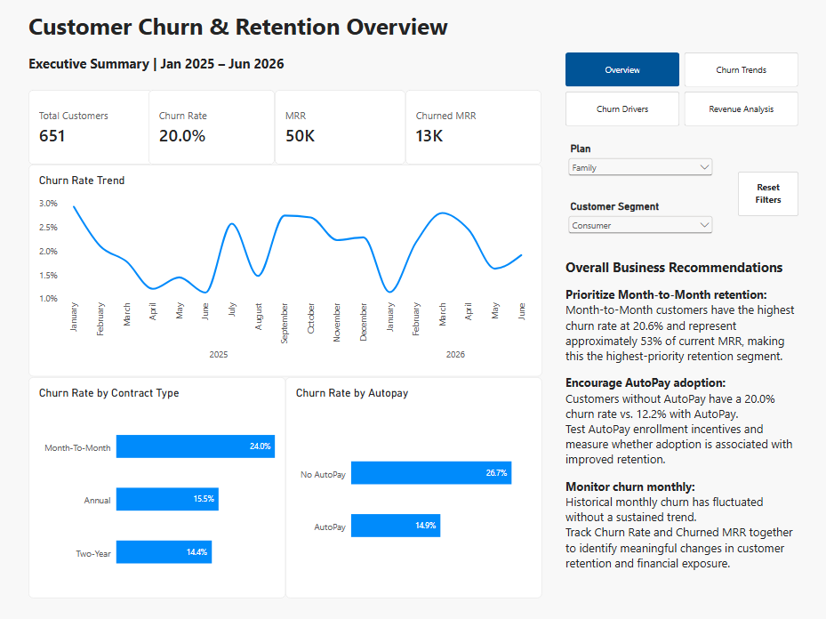
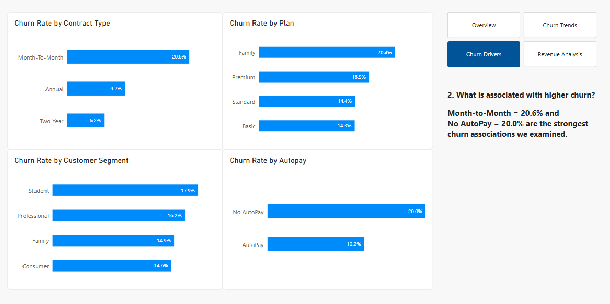
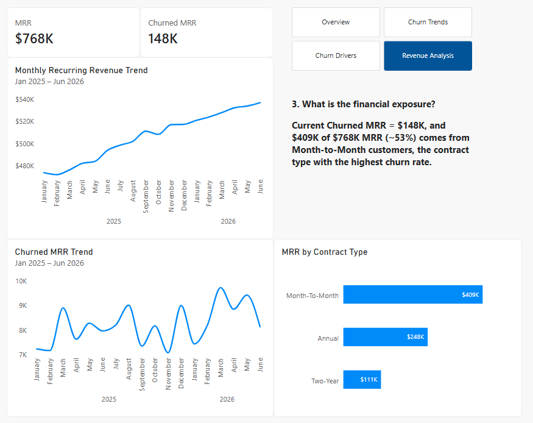

# Customer Churn & Revenue Risk Analysis

## The Decision

Where should the business focus its retention efforts to reduce customer churn while protecting recurring revenue?

This analysis examines 17K customers to identify the strongest churn associations and quantify Monthly Recurring Revenue (MRR) at risk.    

The findings point to two clear retention priorities: **Month-to-Month customers and customers without AutoPay**.

## What the Business Needs to Know

| Churn Rate | Churned MRR | Highest-Risk Contract | AutoPay Gap |
|---|---:|---:|---:|
| **15.4%** | **$148K** | **20.6% Month-to-Month** | **20.0% No AutoPay vs. 12.2% AutoPay** |

The largest retention opportunity is concentrated rather than broad.   

Month-to-Month customers have the highest churn rate and account for approximately **$409K, or 53%, of current MRR**.   

Customers without AutoPay also churn substantially more often than customers enrolled in AutoPay.  

 

[Explore the Dashboard](https://1drv.ms/u/c/fffe1bf0e25e649b/IQDzzUUhJnyASoDbfN97KSmnARCq2NSslKAtp9lfFa0idz8?e=chkAhE)

## Recommended Actions

### 1. Prioritize Month-to-Month retention

Month-to-Month customers have the highest churn rate at **20.6%** and represent approximately **$409K, or 53%, of current MRR**.  
This combination makes them the highest-priority segment for retention efforts.

Test targeted retention offers for Month-to-Month customers, such as incentives to move to Annual or Two-Year contracts.  
Measure conversion, subsequent churn, and retained MRR to determine whether the intervention creates financial value.

### 2. Test AutoPay enrollment as a retention lever

Customers without AutoPay have a **20.0% churn rate compared with 12.2% for AutoPay customers**, an association worth investigating as a potential retention opportunity.

Test an AutoPay enrollment incentive among eligible non-AutoPay customers and compare subsequent churn with a control group before deciding whether to scale the program.

### 3. Monitor churn together with revenue exposure

Monthly churn fluctuates over time without a sustained upward or downward trend. Churn rate alone, however, does not show how much recurring revenue is exposed.

Monitor **Churn Rate and Churned MRR together** so retention decisions account for both customer loss and financial impact.

## How I Built It

- **Power Query:** Cleaned and standardized customer, subscription, support ticket, and plan data; appended subscription files and merged related datasets.
- **Data Modeling:** Built relationships across customer, subscription, support, plan, and calendar table.
- **DAX:** Created measures for Churn Rate, Monthly Recurring Revenue (MRR), Churned MRR, customer counts, and time-based analysis.
- **Power BI:** Built a four-page interactive report with slicers, page navigation, reset-filter bookmarks, KPI cards, trend analysis, and churn-driver views.
- **Tools:** Excel, Power Query, Power Pivot, DAX, Power BI
